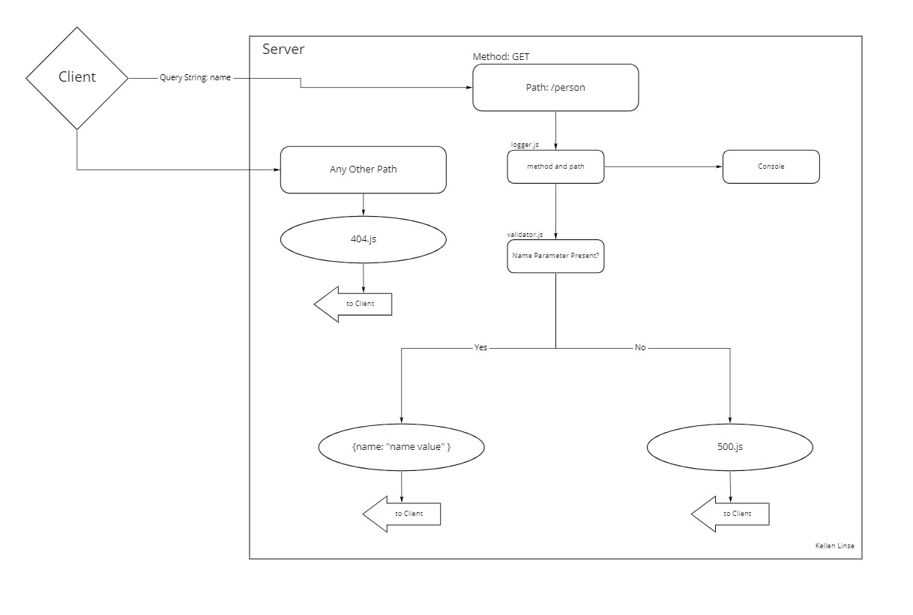

# basic-express-server 

create basic express server for Code Fellows 401

## HTTP Express Server deployed on Heroku.

Deployed at: https://cf-basic-express-server.herokuapp.com/

## Installation

to install run `git clone git@github.com:Kellen-Linse/basic-express-server`

`cd` into express-server-deployment

run `npm install`

## Usage

To start server run : `npm start`

To test server run: `npm test`

## Routes

* POST `/person/?name=<insert name>` - creates a name and returns it as a property on an object:

## Features

* Object 

        {
          name: string
        }
